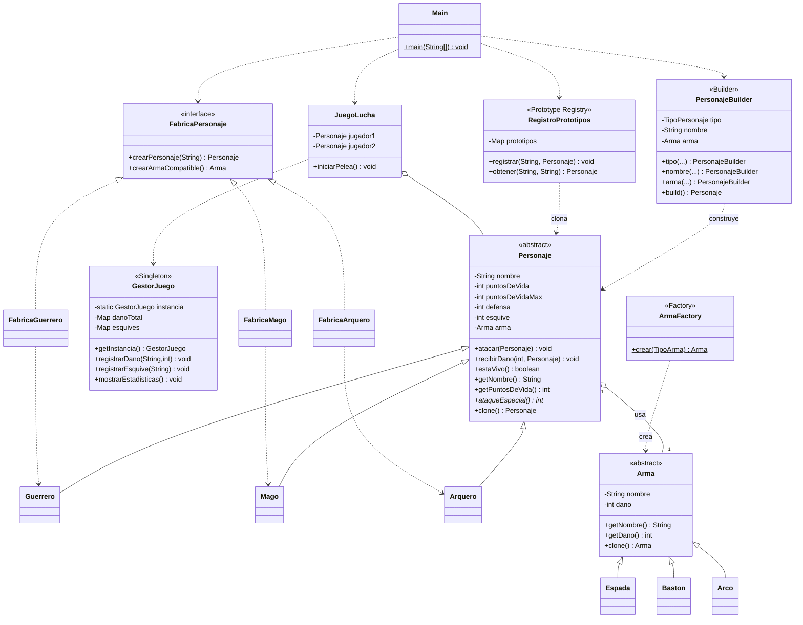

# Diagrama de Clases - Juego de Lucha (Patrones Creacionales)

## Diagrama Mermaid



## Diagrama ASCII (resumen rapido)

```
                +---------------------+
                |     <<abstract>>    |
                |      Personaje      |<>------> Arma (<<abstract>>)
                +---------------------+              ^
                  ^        ^        ^                |
                  |        |        |        +-------+-------+
              Guerrero   Mago   Arquero    Espada  Baston   Arco

  PATRONES CREACIONALES:
  - Singleton ............ GestorJuego
  - Factory Method ....... ArmaFactory
  - Abstract Factory ..... FabricaPersonaje -> FabricaGuerrero/Mago/Arquero
  - Builder .............. PersonajeBuilder
  - Prototype ............ Personaje.clone() + RegistroPrototipos
```
